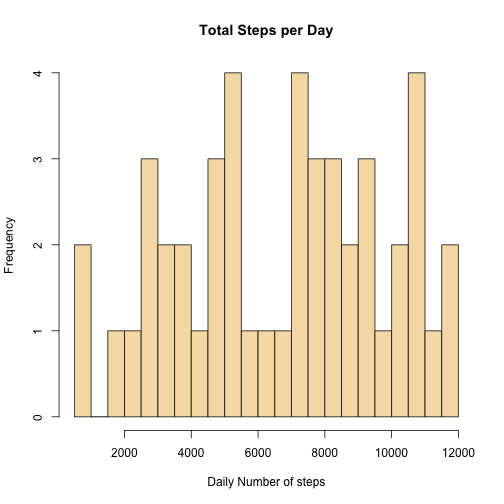
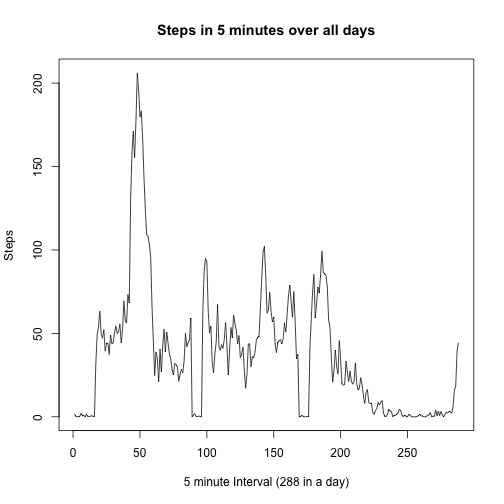
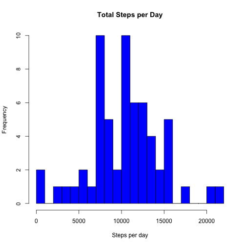
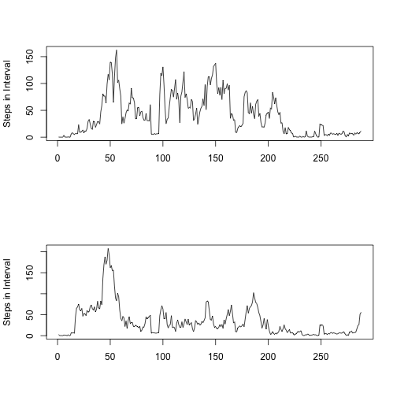

##Initalization##
Initially load libraries and data

```r
options(digits=8)
library(graphics)
activity <- read.csv("activity.csv", header=TRUE, sep=",", quote="\"", na.strings="NA", stringsAsFactors=FALSE)
tmptime <- activity$interval
tmptime <- paste(floor(tmptime/60), ifelse(tmptime-60*floor(tmptime/60)<10, paste("0",tmptime-60*floor(tmptime/60), sep=""), tmptime-60*floor(tmptime/60)), sep=":") #hh:mm, with 0 padding on minutes
timeToAct <- data.frame(strptime(paste(activity$date, tmptime, sep=" "), format="%Y-%m-%d %H:%M"), activity$steps)
colnames(timeToAct) <- c("Date", "Steps") #human understandable
timeToAct$Date <- as.POSIXlt(timeToAct$Date) #easier to divide up by day
dateToAct <- data.frame(activity$date, tmptime, activity$steps) #easier to divide up by interval
colnames(dateToAct) <- c("Date", "Time", "Steps")
```

##Daily##
Now to get the number of steps per day:

```r
daytotals <-tapply(timeToAct$Steps, INDEX=timeToAct$Date$yday, FUN=sum)
daytotmean <- mean(daytotals, na.rm=TRUE)
daytotmed <- median(daytotals, na.rm=TRUE)
hist(daytotals, xlab="Daily Number of steps", col="wheat", main="Total Steps per Day", breaks=20)
```

 

The median is 7215 and the mean is 6741.65957447.

##Interval##
Now to cut by 5 minute interval (ignoring NA values)

```r
stepsAtTime<-tapply(dateToAct$Steps, INDEX=dateToAct$Time, FUN=mean, na.rm=TRUE)
maxsteps <- max(stepsAtTime)
indexOfMax <- which(stepsAtTime==max(stepsAtTime))
intervalMax <- 5*indexOfMax
formattedmax <- paste(floor(intervalMax/60), ifelse(intervalMax-60*floor(intervalMax/60)<10, paste("0",intervalMax-60*floor(intervalMax/60), sep=""), intervalMax-60*floor(intervalMax/60)), sep=":")
plot(stepsAtTime, type="l", xlab="5 minute Interval (288 in a day)", ylab="Steps", main="Steps in 5 minutes over all days")
```

 

The maximum was 206.16981132 at 4:00.

##Dealing with missing values:##
In place of NA values, we substitute the mean of the interval in which the value occurs, as evaluated above in stepsAtTime.

```r
totna <- sum(is.na(timeToAct$Steps))
percenttot <- (sum(is.na(timeToAct$Steps))/length(timeToAct$Steps))*100

filledsteps <- dateToAct #broken up first
while(length(which(is.na(filledsteps$Steps)))>0) {   #fill in all na values
   i=which(is.na(filledsteps$Steps))[1] #take first element index
   hrmin<-strsplit(as.character(filledsteps[i,]$Time), split=":") #get the interval index for stepsAtTime
   intervali<- (as.numeric(hrmin[[1]][1])*60 + as.numeric(hrmin[[1]][2]))/5 +1  #0:00 is the first element
   if(intervali>288) {intervali<-1}    #some 24:00 in data as well as 0:00
   filledsteps[i,]$Steps <- stepsAtTime[intervali]
}
daysums <- tapply(filledsteps$Steps, INDEX=filledsteps$Date, FUN=sum)
daySumMean <- mean(daysums)
daySumMedian <- median(daysums)
hist(daysums, xlab="Steps per day", main="Total Steps per Day", col="blue", breaks=20)
```

 

The total number of missing values is 2304, that being 13.1147541% of the data.  Once missing values are filled in with the mean of their timeslot, we get an average daily mean step count of 1.02940353 &times; 10<sup>4</sup> and median of 1.0395 &times; 10<sup>4</sup>.  This compares with the NA-containing data having median 7215 and the mean 6741.65957447.


##Weekdays vs Weekends##
Using the weekdays() function to seperate weekdays from weekends, we then compare them.  In order to reduce the length of this report, much of the dataframes above will be used.

```r
weekdayq <- function(date){
   tmp <- weekdays(as.Date(as.character(date)))    #not so nice factor problems eliminated
   if(tmp=="Sunday" || tmp=="Saturday") {
      return(1)
   } else {
      return(0)
   }
}

weekdayData <- filledsteps    #as above
weekdayType <- tapply(weekdayData$Date,INDEX = 1:length(weekdayData$Steps), FUN=weekdayq)
weekday.factor<-factor(weekdayType, labels = c("Weekday", "Weekend")) #weekday or weekend?
wdayWithFactor <- cbind(weekdayData, weekday.factor)
colnames(wdayWithFactor)[4] <- "Weekday"

weekdaysdata<-subset(wdayWithFactor, Weekday=="Weekday")
weekdayTimeAverage <- tapply(weekdaysdata$Steps, INDEX=weekdaysdata$Time, FUN=mean)
weekdayStepAvg <- sum(weekdayTimeAverage)

weekendsdata<-subset(wdayWithFactor, Weekday=="Weekend")
weekendTimeAverage <- tapply(weekendsdata$Steps, INDEX=weekendsdata$Time, FUN=mean)
weekendStepAvg <- sum(weekendTimeAverage)

par(mfrow=c(2,1))
plot(weekendTimeAverage, ylab="Steps in Interval", xlab="", type="l")
plot(weekdayTimeAverage, ylab="Steps in Interval", xlab="", type="l")
```

 

Thus we can meaningfully compare the weekday to the weekend, both visually time to time and in a mean as well, with the weekdays having an average total of 9775.82473795 steps per day and the weekends having 1.17515024 &times; 10<sup>4</sup> average steps per day.
